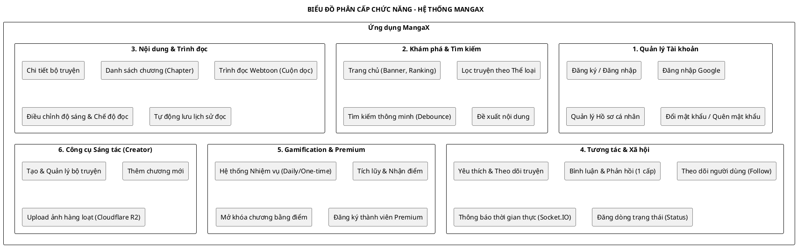

# BIỂU ĐỒ PHÂN CẤP CHỨC NĂNG (FUNCTIONAL DECOMPOSITION DIAGRAM)

Dưới đây là biểu đồ mô tả cấu trúc các tính năng của ứng dụng MangaX được trình bày bằng ngôn ngữ PlantUML.

## 1. Mã nguồn PlantUML

## 2. Mô tả các nhóm chức năng chính

### 2.1. Quản lý Tài khoản (Authentication & User)
Cung cấp các phương thức xác thực bảo mật qua JWT (Access Token & Refresh Token). Cho phép người dùng cá nhân hóa thông tin cá nhân và quản lý trạng thái đăng nhập trên nhiều nền tảng.

### 2.2. Khám phá & Tìm kiếm (Discovery)
Hệ thống điều hướng giúp người dùng tiếp cận nội dung nhanh nhất thông qua các bộ lọc thể loại, bảng xếp hạng (Like/View) và cơ chế tìm kiếm tối ưu hóa hiệu năng (Debounce search).

### 2.3. Nội dung & Trình đọc (Manga Reader)
Trái tim của ứng dụng, hỗ trợ đọc truyện mượt mà với tính năng cache ảnh thông minh, tải trước (pre-load) trang tiếp theo và lưu trữ vị trí chương đã đọc gần nhất.

### 2.4. Tương tác & Xã hội (Social Interaction)
Xây dựng cộng đồng thông qua các tính năng Like, Follow và Comment. Hệ thống thông báo thời gian thực đảm bảo người dùng luôn cập nhật được các hoạt động mới nhất từ bộ truyện hoặc người dùng mà họ quan tâm.

### 2.5. Gamification & Hệ thống Điểm (Reward System)
Tăng tỷ lệ giữ chân người dùng (Retention rate) bằng cách khuyến khích hoàn thành nhiệm vụ để nhận điểm. Điểm thưởng được dùng làm "tiền tệ" trong app để mở khóa các nội dung trả phí hoặc nội dung độc quyền.

### 2.6. Công cụ Sáng tác (Creator Tools)
Dành cho người dùng có vai trò 'creator' hoặc 'admin'. Cung cấp giao diện upload mạnh mẽ, tích hợp trực tiếp với Cloudflare R2 để xử lý khối lượng lớn hình ảnh chất lượng cao.
