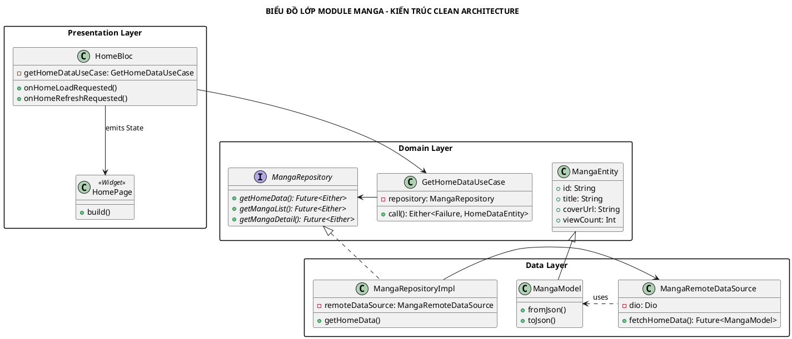

# BIỂU ĐỒ LỚP CHI TIẾT (CLASS DIAGRAM)

Biểu đồ này mô tả mối quan hệ giữa các thành phần trong hệ thống theo kiến trúc Clean Architecture.

## 1. Mã nguồn PlantUML

## 2. Giải thích thiết kế lớp

### 2.1. Tính trừu tượng (Abstraction)
Hệ thống sử dụng Interface `MangaRepository` trong lớp Domain để định nghĩa các hành động. Lớp Presentation (Bloc) chỉ biết đến Interface này, không quan tâm đến việc dữ liệu được lấy từ đâu (API, Firebase hay Local DB). Điều này giúp dễ dàng thay đổi logic phía dưới mà không ảnh hưởng đến giao diện.

### 2.2. Sự phụ thuộc (Dependency)
Toàn bộ các lớp được kết nối thông qua **Dependency Injection**. Ví dụ: `MangaRepositoryImpl` được "tiêm" vào `GetHomeDataUseCase`, và UseCase này lại được "tiêm" vào `HomeBloc`. Điều này đảm bảo tính "Loose Coupling" (phụ thuộc lỏng lẻo).

### 2.3. Model vs Entity
*   **MangaEntity**: Chỉ chứa các thuộc tính cần thiết cho ứng dụng, nằm ở vùng lõi và không phụ thuộc bất kỳ thư viện nào.
*   **MangaModel**: Nằm ở lớp Data, chứa các hàm logic liên quan đến JSON. Model kế thừa Entity để truyền dữ liệu lên các lớp trên.
