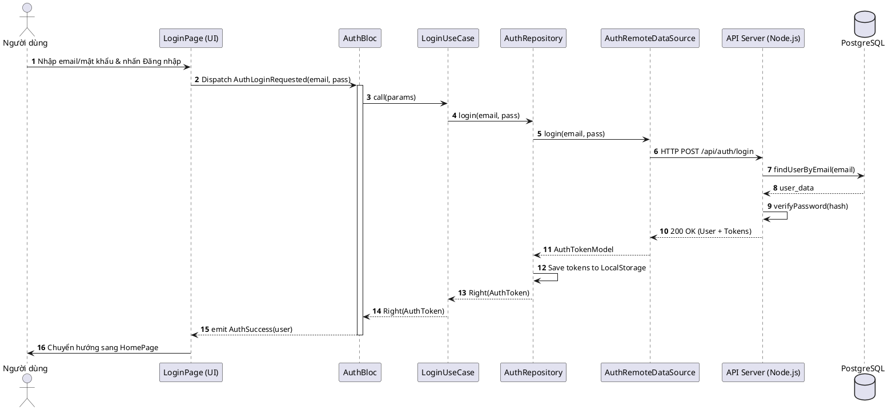

# BIỂU ĐỒ TRÌNH TỰ (SEQUENCE DIAGRAM)

Biểu đồ này mô tả luồng tương tác giữa các lớp khi thực hiện chức năng **Đăng nhập**.

## 1. Mã nguồn PlantUML

## 2. Giải thích luồng xử lý

1.  **Tính đóng gói**: Người dùng chỉ tương tác với lớp UI. UI không bao giờ gọi trực tiếp API mà phải thông qua Bloc.
2.  **Tính minh bạch**: UseCase làm cầu nối, tách biệt logic nghiệp vụ khỏi cách thức lấy dữ liệu.
3.  **Xử lý bất đồng bộ**: Toàn bộ luồng từ RDS đến Repository đều xử lý bất đồng bộ (Future/Async) để tránh làm treo ứng dụng (ANR).
4.  **Lưu trữ an toàn**: Token được Repository chủ động lưu xuống thiết bị ngay sau khi nhận từ Data Source trước khi báo thành công lên Bloc.
