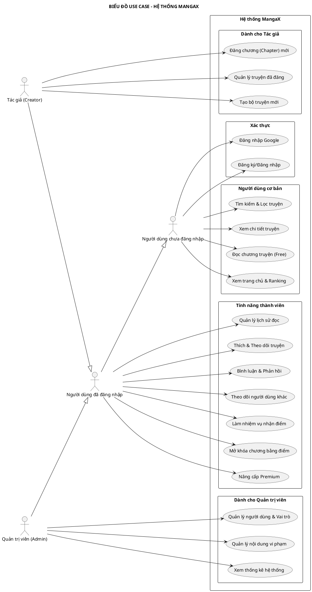

# BIỂU ĐỒ USE CASE (USE CASE DIAGRAM)

Biểu đồ này mô tả các tác nhân chính và các hành động họ thực hiện trong hệ thống MangaX.

## 1. Mã nguồn PlantUML

## 2. Giải thích các tác nhân (Actors)

*   **Guest (Khách)**: Có quyền tiếp cận các nội dung công khai, tìm kiếm và đọc các chương truyện miễn phí.
*   **User (Thành viên)**: Kế thừa toàn bộ quyền của Khách, bổ sung các tính năng tương tác xã hội, tích lũy điểm và quản lý cá nhân.
*   **Creator (Tác giả)**: Kế thừa quyền của Thành viên, có thêm các công cụ để xuất bản và quản lý nội dung truyện.
*   **Admin (Quản trị viên)**: Có quyền cao nhất, quản lý toàn bộ hệ thống từ dữ liệu người dùng đến các số liệu thống kê kinh doanh.
